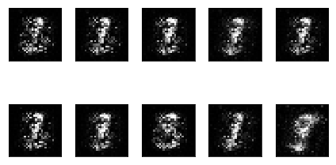
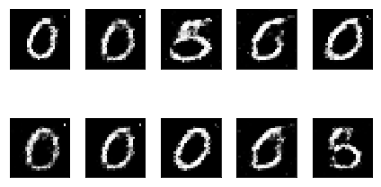
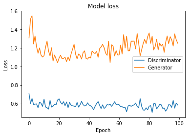
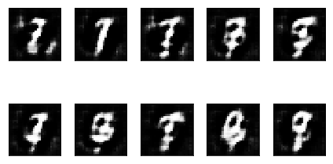
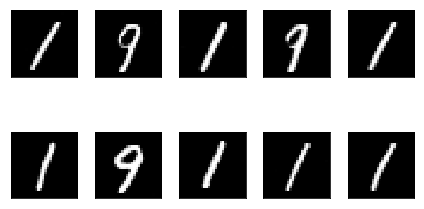
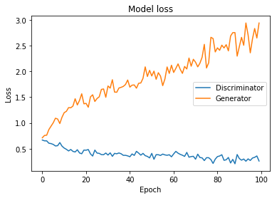

# Generative Adversarial Networks

This repository presents the **basic notions** that involve the concept of Generative Adversarial Networks.

## Models

Definition and training some models, such as:

* [GAN with MNIST]()
* [DCGAN with MNIST]()

## Results

### Training GANs with Keras and TensorFlow
A standard GANs implementations using fully connected layers and the [Keras](https://keras.io/) library.

* Generated MNIST images at epoch 10.

* Generated MNIST images at epoch 90.

* Loss at every epoch for 100 epochs.

### Training DCGANs with Keras and TensorFlow
A DCGANs implementation using the transposed convolution technique and the [Keras](https://keras.io/) library.

* Generated MNIST images at epoch 10.

* Generated MNIST images at epoch 90.

* Loss at every epoch for 100 epochs.

# generative_adversarial_networks_101
