# Generative Adversarial Networks

This repository presents the **basic notions** that involve the concept of Generative Adversarial Networks.

> *"...the most interesting idea in the last 10 years in ML". Yann LeCun*

## Definition

[Generative Adversarial Networks or GANs](https://arxiv.org/abs/1406.2661) is a framework proposed by [Ian Goodfellow](http://www.iangoodfellow.com/), Yoshua Bengio and others in 2014.

GANs are composed of two models, represented by artificial neural network:
* The first model is called a **Generator** and it aims to generate new data similar to the expected one. 
* The second model is named the **Discriminator** and it aims to recognize if an input data is ‘real’ — belongs to the original dataset — or if it is ‘fake’ — generated by a forger.

    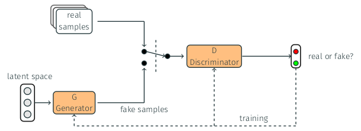

## Models

Definition and training some models with MNIST and CIFAR-10 datasets.

### MNIST dataset

* [GAN - MNIST](https://github.com/mafda/generative_adversarial_networks_101/blob/master/src/mnist/01_GAN_MNIST.ipynb)
* [DCGAN - MNIST](https://github.com/mafda/generative_adversarial_networks_101/blob/master/src/mnist/02_DCGAN_MNIST.ipynb)
* [CGAN - MNIST](https://github.com/mafda/generative_adversarial_networks_101/blob/master/src/mnist/03_CGAN_MNIST.ipynb)
* [CCGAN - MNIST](https://github.com/mafda/generative_adversarial_networks_101/blob/master/src/mnist/04_CCGAN_MNIST.ipynb)

### CIFAR-10 dataset

* [DCGAN - CIFAR10](https://github.com/mafda/generative_adversarial_networks_101/blob/master/src/cifar10/02_DCGAN_CIFAR10.ipynb)
* [CGAN - CIFAR10](https://github.com/mafda/generative_adversarial_networks_101/blob/master/src/cifar10/03_CGAN_CIFAR10.ipynb)

## Results

Training models with Keras and TensorFlow.

### MNIST dataset

#### Generative Adversarial Networks - GANs
A GANs implementation using fully connected layers. [Code.](https://github.com/mafda/generative_adversarial_networks_101/blob/master/src/mnist/01_GAN_MNIST.ipynb)

| Epoch 00 | Epoch 100 | Loss |
|----------|-----------|------|
| 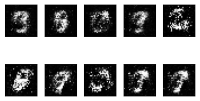 | | 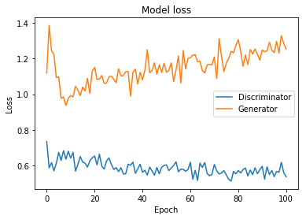|

#### Deep Convolutional Generative Adversarial Networks - DCGANs
A DCGANs implementation using the transposed convolution technique. [Code.](https://github.com/mafda/generative_adversarial_networks_101/blob/master/src/mnist/02_DCGAN_MNIST.ipynb)

| Epoch 00 | Epoch 100 | Loss |
|----------|-----------|------|
| 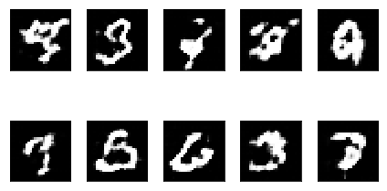 | | 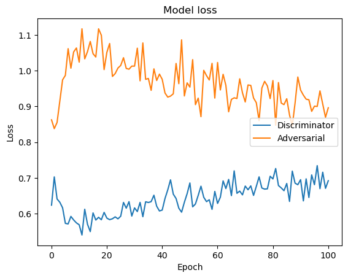|

#### Conditional Generative Adversarial Nets - CGANs
A CGANs implementation using fully connected layers and embedding layers. [Code.](https://github.com/mafda/generative_adversarial_networks_101/blob/master/src/mnist/03_CGAN_MNIST.ipynb)

| Epoch 00 | Epoch 100 | Loss |
|----------|-----------|------|
| 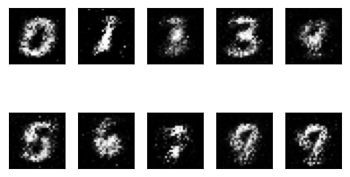 | | 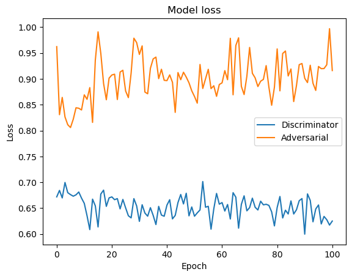|

#### Context-Conditional Generative Adversarial Networks - CCGANs
A CCGANs implementation using U-Net and convolutional neural network. [Code.](https://github.com/mafda/generative_adversarial_networks_101/blob/master/src/mnist/04_CCGAN_MNIST.ipynb)

| Epoch 00 | Epoch 100 | Loss |
|----------|-----------|------|
| 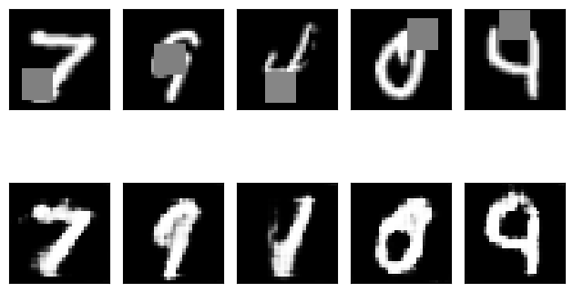 | | 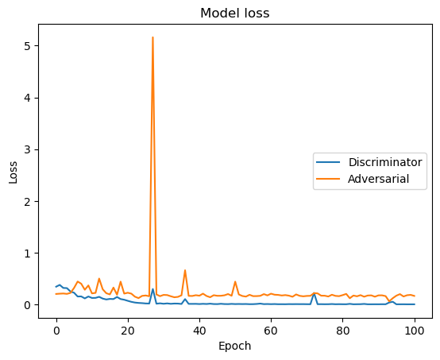|

### CIFAR-10 dataset

#### Deep Convolutional Generative Adversarial Networks - DCGANs
A DCGANs implementation using the transposed convolution technique. [Code.](https://github.com/mafda/generative_adversarial_networks_101/blob/master/src/cifar10/02_DCGAN_CIFAR10.ipynb)

| Epoch 00 | Epoch 100 | Loss |
|----------|-----------|------|
| 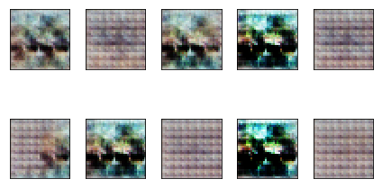 | 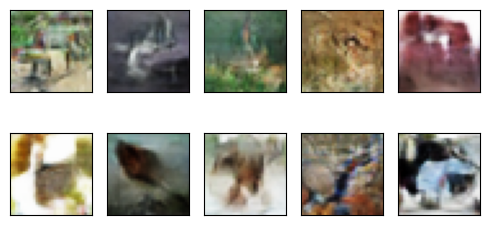| 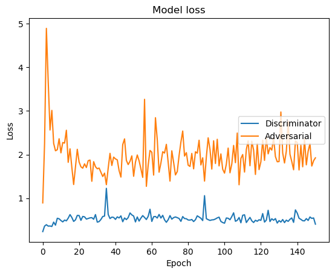|

#### Conditional Generative Adversarial Networks - CGANs
A CGANs implementation using the transposed convolution and convolution neural network, and concatenate layers. [Code.](https://github.com/mafda/generative_adversarial_networks_101/blob/master/src/cifar10/03_CGAN_CIFAR10.ipynb)

| Epoch 00 | Epoch 100 | Loss |
|----------|-----------|------|
| 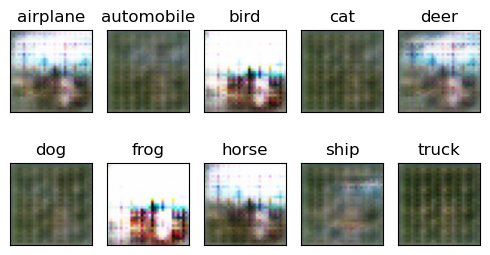 | 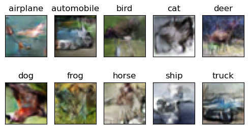| 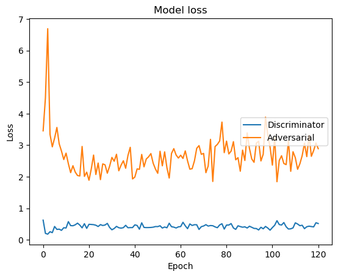|

---

## References

* Related papers:
    * [Generative Adversarial Networks](https://arxiv.org/abs/1406.2661)
    * [Unsupervised Representation Learning With Deep Convolutional](https://arxiv.org/pdf/1511.06434.pdf)
    * [Conditional Generative Adversarial Nets](https://arxiv.org/pdf/1411.1784.pdf)
    * [Semi-Supervised Learning with Context-Conditional Generative Adversarial Networks](https://arxiv.org/pdf/1611.06430.pdf)
    
* Datasets:
    * [THE MNIST DATABASE of handwritten digits](http://yann.lecun.com/exdb/mnist/)
    * [The CIFAR-10 dataset](https://www.cs.toronto.edu/%7Ekriz/cifar.html)
    
* Other repositories:
    * [How to Train a GAN? Tips and tricks to make GANs work](https://github.com/soumith/ganhacks)
    * [The GAN Zoo](https://github.com/hindupuravinash/the-gan-zoo)
    * [Adversarial Nets Papers](https://github.com/zhangqianhui/AdversarialNetsPapers)
    * [Keras-GAN](https://github.com/eriklindernoren/Keras-GAN)

