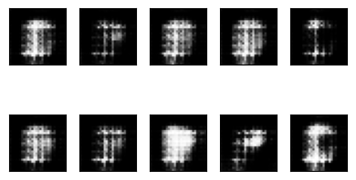
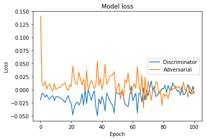
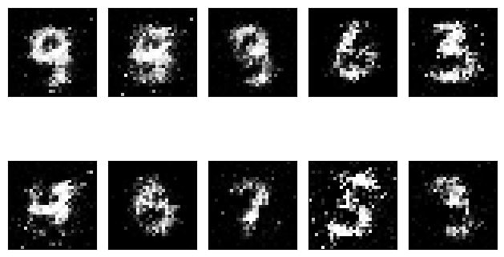
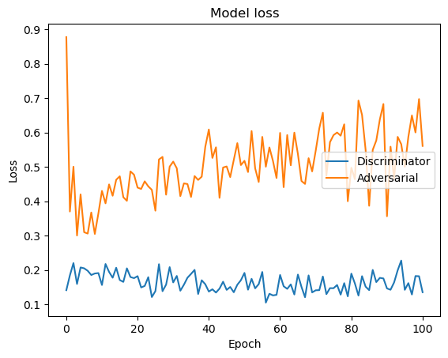

# Generative Adversarial Networks - GANs

This repository presents the **basic notions** that involve the concept of Generative Adversarial Networks.

> *"...the most interesting idea in the last 10 years in ML". Yann LeCun*

## Definition

[Generative Adversarial Networks or GANs](https://arxiv.org/abs/1406.2661) is a framework proposed by [Ian Goodfellow](http://www.iangoodfellow.com/), Yoshua Bengio and others in 2014.

GANs are composed of two models, represented by artificial neural network:
* The first model is called a **Generator** and it aims to generate new data similar to the expected one.
* The second model is named the **Discriminator** and it aims to recognize if an input data is ‘real’ — belongs to the original dataset — or if it is ‘fake’ — generated by a forger.

<p align="center">
    
</p>

Read more in this post [GANs — Generative Adversarial Networks 101](https://mafda.medium.com/gans-generative-adversarial-networks-101-8bf8e304585c).

## Configure environment

- Create the conda environment

```shell
(base)$: conda env create -f environment.yml
```

- Activate the environment

```shell
(base)$: conda activate gans_101
```

- Run!

```shell
(gans_101)$: python -m jupyter notebook
```

### Note!

:tada: Run with environment!

- [x] GAN - MNIST

:construction: Under Construction

- [ ] DCGAN - MNIST
- [ ] CGAN - MNIST
- [ ] CCGAN - MNIST
- [ ] WGAN - MNIST
- [ ] LSGAN - MNIST
- [ ] DCGAN - CIFAR10
- [ ] CGAN - CIFAR10

## Models

Definition and training some models with MNIST and CIFAR-10 datasets.

### MNIST dataset

* GAN - MNIST [Notebook](https://github.com/mafda/generative_adversarial_networks_101/blob/master/src/mnist/01_GAN_MNIST.ipynb) - [Post Medium](https://mafda.medium.com/gans-generative-adversarial-network-with-mnist-part-db8b9c061de0)
* DCGAN - MNIST [Notebook](https://github.com/mafda/generative_adversarial_networks_101/blob/master/src/mnist/02_DCGAN_MNIST.ipynb) - [Post Medium](https://mafda.medium.com/gans-deep-convolutional-gans-with-mnist-part-3-8bad9a96ff65)
* CGAN - MNIST [Notebook](https://github.com/mafda/generative_adversarial_networks_101/blob/master/src/mnist/03_CGAN_MNIST.ipynb) - [Post Medium](https://mafda.medium.com/gans-conditional-gans-with-mnist-part-4-7f816d274d8c)
* CCGAN - MNIST [Notebook](https://github.com/mafda/generative_adversarial_networks_101/blob/master/src/mnist/04_CCGAN_MNIST.ipynb) - [Post Medium](https://mafda.medium.com/gans-context-conditional-gans-with-mnist-part-5-a8d56a243377)
* WGAN - MNIST [Notebook](https://github.com/mafda/generative_adversarial_networks_101/blob/master/src/mnist/05_WGAN_MNIST.ipynb) - [Post Medium](https://mafda.medium.com/gans-wasserstein-gan-with-mnist-part-6-7f796a0cea47)
* LSGAN - MNIST [Notebook](https://github.com/mafda/generative_adversarial_networks_101/blob/master/src/mnist/06_LSGAN_MNIST.ipynb) - [Post Medium](https://mafda.medium.com/gans-least-squares-gans-with-mnist-part-7-e6cf2fff503c)

### CIFAR-10 dataset

* DCGAN - CIFAR10 [Notebook](https://github.com/mafda/generative_adversarial_networks_101/blob/master/src/cifar10/02_DCGAN_CIFAR10.ipynb) - [Post Medium](https://mafda.medium.com/gans-deep-convolutional-gans-with-cifar10-part-8-be881a77e55b)
* CGAN - CIFAR10 [Notebook](https://github.com/mafda/generative_adversarial_networks_101/blob/master/src/cifar10/03_CGAN_CIFAR10.ipynb) - [Post Medium](https://mafda.medium.com/gans-conditional-gans-with-cifar10-part-9-8e47373e33b8)


## Results

Training models with Keras - TensorFlow.

### MNIST dataset

#### Generative Adversarial Networks - GANs
A GANs implementation using fully connected layers. [Notebook](https://github.com/mafda/generative_adversarial_networks_101/blob/master/src/mnist/01_GAN_MNIST.ipynb)

| Epoch 00                          | Epoch 100                          | Loss                                |
| --------------------------------- | ---------------------------------- | ----------------------------------- |
|  |  |  |

#### Deep Convolutional Generative Adversarial Networks - DCGANs
A DCGANs implementation using the transposed convolution technique. [Notebook](https://github.com/mafda/generative_adversarial_networks_101/blob/master/src/mnist/02_DCGAN_MNIST.ipynb)

| Epoch 00                            | Epoch 100                            | Loss                                  |
| ----------------------------------- | ------------------------------------ | ------------------------------------- |
|  |  |  |

#### Conditional Generative Adversarial Nets - CGANs
A CGANs implementation using fully connected layers and embedding layers. [Notebook](https://github.com/mafda/generative_adversarial_networks_101/blob/master/src/mnist/03_CGAN_MNIST.ipynb)

| Epoch 00                            | Epoch 100                            | Loss                                  |
| ----------------------------------- | ------------------------------------ | ------------------------------------- |
|  |  |  |

#### Context-Conditional Generative Adversarial Networks - CCGANs
A CCGANs implementation using U-Net and convolutional neural network. [Notebook](https://github.com/mafda/generative_adversarial_networks_101/blob/master/src/mnist/04_CCGAN_MNIST.ipynb)

| Epoch 00                             | Epoch 100                             | Loss                                   |
| ------------------------------------ | ------------------------------------- | -------------------------------------- |
|  |  |  |

#### Wasserstein Generative Adversarial Networks - WGANs
A WGANs implementation using convolutional neural network. [Notebook](https://github.com/mafda/generative_adversarial_networks_101/blob/master/src/mnist/05_WGAN_MNIST.ipynb)

| Epoch 00                            | Epoch 100                            | Loss                                  |
| ----------------------------------- | ------------------------------------ | ------------------------------------- |
|  |  |  |

#### Least Squares General Adversarial Networks - LSGANs
A LSGANs implementation using using fully connected layers. [Notebook](https://github.com/mafda/generative_adversarial_networks_101/blob/master/src/mnist/06_LSGAN_MNIST.ipynb)

| Epoch 00                                    | Epoch 100                                    | Loss                                          |
| ------------------------------------------- | -------------------------------------------- | --------------------------------------------- |
|  |  |  |


### CIFAR-10 dataset

#### Deep Convolutional Generative Adversarial Networks - DCGANs
A DCGANs implementation using the transposed convolution technique. [Notebook](https://github.com/mafda/generative_adversarial_networks_101/blob/master/src/cifar10/02_DCGAN_CIFAR10.ipynb)

| Epoch 00                                       | Epoch 100                                       | Loss                                             |
| ---------------------------------------------- | ----------------------------------------------- | ------------------------------------------------ |
|  |  |  |

#### Conditional Generative Adversarial Networks - CGANs
A CGANs implementation using the transposed convolution and convolution neural network, and concatenate layers. [Notebook](https://github.com/mafda/generative_adversarial_networks_101/blob/master/src/cifar10/03_CGAN_CIFAR10.ipynb)

| Epoch 00                                     | Epoch 100                                     | Loss                                           |
| -------------------------------------------- | --------------------------------------------- | ---------------------------------------------- |
|  |  |  |

---

## References

* Complete Post Medium
  * [GANs — Generative Adversarial Networks 101](https://mafda.medium.com/gans-generative-adversarial-networks-101-8bf8e304585c)

* Related papers:
    * [Generative Adversarial Networks](https://arxiv.org/abs/1406.2661)
    * [Unsupervised Representation Learning With Deep Convolutional](https://arxiv.org/pdf/1511.06434.pdf)
    * [Conditional Generative Adversarial Nets](https://arxiv.org/pdf/1411.1784.pdf)
    * [Semi-Supervised Learning with Context-Conditional Generative Adversarial Networks](https://arxiv.org/pdf/1611.06430.pdf)
    * [Wasserstein GAN](https://arxiv.org/pdf/1701.07875.pdf)
    * [Least Squares General Adversarial Networks](https://arxiv.org/pdf/1611.04076.pdf)

* Datasets:
    * [THE MNIST DATABASE of handwritten digits](http://yann.lecun.com/exdb/mnist/)
    * [The CIFAR-10 dataset](https://www.cs.toronto.edu/%7Ekriz/cifar.html)

* Other repositories:
    * [Keras-GAN](https://github.com/eriklindernoren/Keras-GAN)
    * [Adversarial Nets Papers](https://github.com/zhangqianhui/AdversarialNetsPapers)
    * [How to Train a GAN? Tips and tricks to make GANs work](https://github.com/soumith/ganhacks)
    * [The GAN Zoo](https://github.com/hindupuravinash/the-gan-zoo)
    * [GAN Lab: An Interactive, Visual Experimentation Tool for Generative Adversarial Networks](https://github.com/poloclub/ganlab)
    * [gans-awesome-applications](https://github.com/nashory/gans-awesome-applications)
    * [tensorflow-generative-model-collections](https://github.com/hwalsuklee/tensorflow-generative-model-collections)

---

made with 💙 by [mafda](https://mafda.github.io/)
