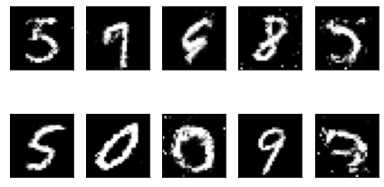
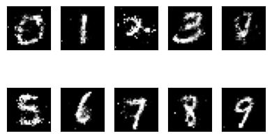
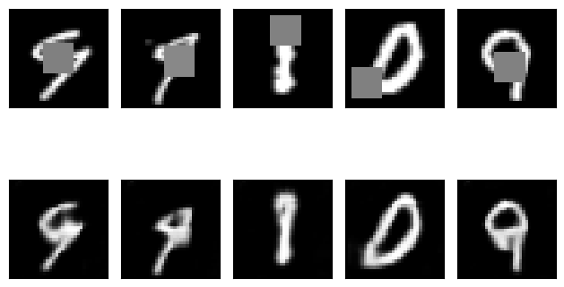
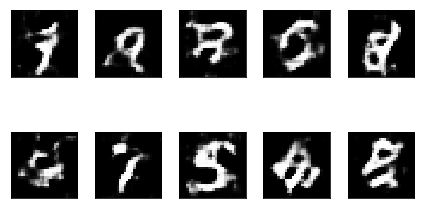
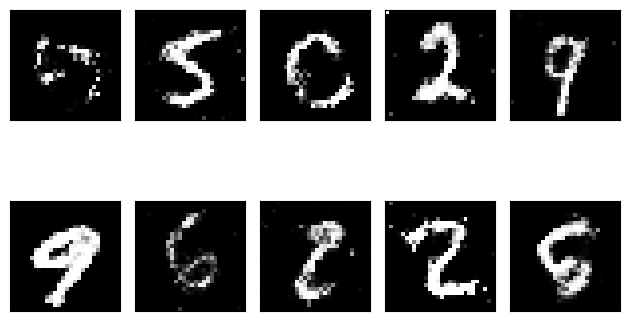

# Generative Adversarial Networks with MNIST

Some implementations in **Keras** of Generative Adversarial Networks - GANs models with the **MNIST database**. 

## Models

### GANs

Generative Adversarial Networks: [Code](https://github.com/mafda/generative_adversarial_networks_101/blob/master/src/mnist/01_GAN_MNIST.ipynb).

    

### DCGANs

Deep Convolutional Generative Adversarial Networks: [Code](https://github.com/mafda/generative_adversarial_networks_101/blob/master/src/mnist/02_DCGAN_MNIST.ipynb).

    

### CGANs

Conditional Generative Adversarial Nets: [Code](https://github.com/mafda/generative_adversarial_networks_101/blob/master/src/mnist/03_CGAN_MNIST.ipynb).

    

### CCGANs

Context-Conditional Generative Adversarial Networks: [Code](https://github.com/mafda/generative_adversarial_networks_101/blob/master/src/mnist/04_CCGAN_MNIST.ipynb).

    

### WGAN

Wasserstein Generative Adversarial Networks: [Code](https://github.com/mafda/generative_adversarial_networks_101/blob/master/src/mnist/05_WGAN_MNIST.ipynb).

    

### LSGAN

Least Squares General Adversarial Networks: [Code](https://github.com/mafda/generative_adversarial_networks_101/blob/master/src/mnist/06_LSGAN_MNIST.ipynb).

    

## Dataset

[THE MNIST DATABASE of handwritten digits](http://yann.lecun.com/exdb/mnist/).